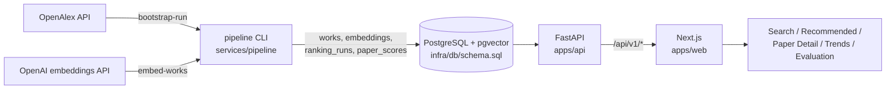

# Architecture

Research Radar is a three-part system: a Python pipeline that builds a
versioned corpus and ranking runs in PostgreSQL, a read-only FastAPI service
over those tables, and a Next.js app that renders the product surfaces.

## Components

| Path | Role |
| --- | --- |
| `services/pipeline` | ETL and offline jobs: corpus bootstrap from OpenAlex, text normalization, embedding runs, clustering, and ranking-run materialization. Entry point: `python -m pipeline.cli`. |
| `apps/api` | Read-only FastAPI service. Pydantic contracts in `app/contracts.py`, SQL isolated in `*_repo.py` modules, routes in `app/main.py`. Has a fixture mode (`RESEARCH_RADAR_DATA_MODE=fixture`) that serves checked-in toy data without a database. |
| `apps/web` | Next.js (App Router) frontend. Server components fetch the API directly; no client-side data store. |
| `infra/db` | Single canonical schema (`schema.sql`) for PostgreSQL + pgvector, applied on first `docker compose up`. |
| `docs/audit` | Frozen model artifacts pinned by the deployed scorers (see its README). |

## Core data model

Everything user-visible hangs off versioned, immutable run records:

- **`works`** - normalized OpenAlex papers, keyed by `corpus_snapshot_version`.
  Raw OpenAlex payloads are retained alongside normalized rows.
- **`embeddings`** - one vector per `(work_id, embedding_version)`. Multiple
  embedding versions coexist so retrieval experiments stay comparable.
- **`ranking_runs` / `paper_scores`** - a ranking run materializes one score
  row per `(work, family)` for the families `emerging`, `undercited`, and
  `bridge`, with per-signal breakdowns so every recommendation is explainable.
- **`ingest_runs` / `ingest_watermarks` / `source_snapshot_versions`** -
  first-class ingest state: every corpus slice is reproducible and auditable.

The API never writes. Pages resolve either the latest succeeded run for a
pinned `ranking_version` or an explicit `ranking_run_id` passed in the URL,
which is how archived baselines stay inspectable.

## Ranking and ML serving

The default ranking is heuristic (citation/recency rank fusion per family).
Two bounded ML scorers can re-order feeds at request time behind explicit
deployment gates; both fail closed to the materialized heuristic ordering:

- **Emerging** - `pipeline/ml_scorer_rollout_serving.py` re-scores the pinned
  candidate pool with a frozen embedding-probability scorer
  (`docs/audit/ml-offline-audit-embedding-scorer-v2.json`).
- **Bridge (canary only)** - `pipeline/ml_bridge_scorer_rollout_serving.py`
  blends rank percentiles of a frozen logistic-regression probability and the
  materialized `bridge_score`, governed by a SHA-256-pinned serving plan.

The API calls these lazily through `apps/api/app/ml_scorer_rollout.py` and
`ml_bridge_scorer_rollout.py`; if flags are off, the pinned run is missing, or
any artifact check fails, responses fall back to `materialized_heuristic` and
say so in `ranking_mode`.

## Local environments

- **Fixture demo** (`npm run demo:local`) - API + web with checked-in toy
  data; no Postgres or API keys.
- **Full stack** (`docker compose up -d`, then pipeline CLI + uvicorn +
  `npm run dev:web`) - see the README quickstart.

## Verification

`npm run validate` is the pre-merge check CI runs: web lint + build, and
`pytest services/pipeline/tests apps/api/tests`.
